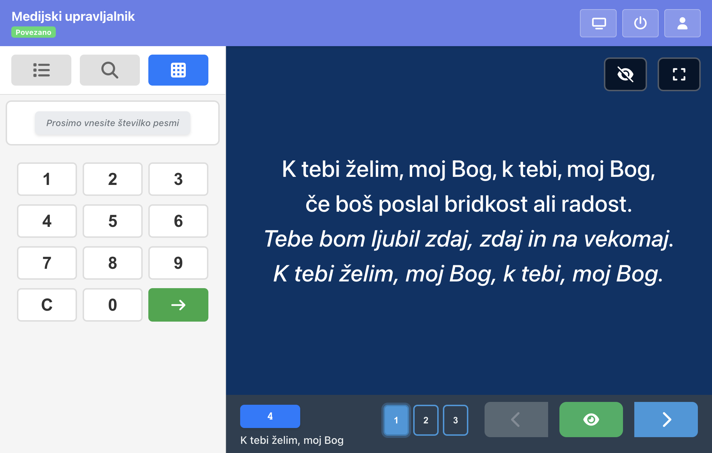

# Uporabniški priročnik – navodila

## Ustvarjanje PDF z posnetki zaslona

### 1. Posnetki zaslona

Za vključitev posnetkov zaslona v priročnik:

1. Zaženite admin aplikacijo (`npm run start:admin` v mapi admin)
2. Odprite brskalnik na http://localhost:4201 (ali ustreznem naslovu)
3. Naredite posnetke zaslona posameznih pogledov:
   - **01-prijava.png** – prijavni zaslon
   - **02-navigacija.png** – glavna vrstica z gumbi po prijavi
   - **03-projekcija.png** – projekcija s stranskim panelom in predogledom
   - **04-knjiznica.png** – urejevalnik knjižnice
   - **05-seznami.png** – urejevalnik seznama predvajanja
   - **06-zbirke.png** – urejanje zbirk ali oznak
   - **07-nastavitve.png** – splošne nastavitve
   - **08-daljinec.png** – televizijski daljinec
   - **09-profil.png** – uporabniški profil

4. Shranite slike v mapo `docs/screenshots/`

### 2. Vključitev slik v priročnik

Odprite `docs/uporabniski-prirocnik-admin.html` in zamenjajte posamezne bloke `screenshot-placeholder` z ustreznimi slikami. Na primer:

**Pred:**
```html
<div class="screenshot-placeholder" id="screenshot-prijava">
  Slika 1: Prikaz prijavnega zaslona.
</div>
```

**Po:**
```html
<figure>
  
  <figcaption>Slika 1: Prikaz prijavnega zaslona</figcaption>
</figure>
```

### 3. Ustvarjanje PDF

**Možnost A – Brskalnik (preporočeno):**
1. Odprite `docs/uporabniski-prirocnik-admin.html` v brskalniku (Chrome, Firefox, Edge)
2. Pritisnite `Ctrl+P` (Windows/Linux) ali `Cmd+P` (Mac)
3. Izberite »Shrani kot PDF« kot cilj tiskanja
4. Kliknite Shrani

**Možnost B – Puppeteer (za avtomatizacijo):**
```bash
npx puppeteer docs/uporabniski-prirocnik-admin.html --format=pdf --path=docs/uporabniski-prirocnik-admin.pdf
```
*Opomba: zahtevana je nameščena različica Node.js in morda dodatna konfiguracija.*

## Struktura dokumentacije

- `uporabniski-prirocnik-admin.html` – glavni priročnik v slovenščini
- `screenshots/` – mapa za posnetke zaslona
- `README-prirocnik.md` – ta navodila
